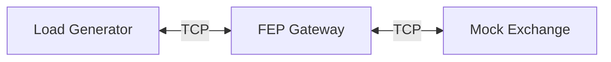

# opinion
첫 시작은 CPU 코어에 스레드가 고정되어 실행된다면 컨텍스트 스위칭 이후 다시 코어로 돌아오니 캐시 재사용성이 증가한다는 이론적 개념을 이해했습니다.
리눅스 커널 레벨에서 SO_REUSEPORT로  I/O워커 스레드에 분배된다는 개념을 이해하고, 이 구조를 머릿속에 집어넣고 프로젝트를 진행했습니다.

이 엔진은 학습 목적으로 제작을 시작했습니다. 하지만 좋은 엔진을 만들어보고 싶다는 생각에 사용하지 않는 기능을 미리 추가하는 등의 잘못된 방향으로 진행되었습니다.
개발 환경, 인프라, 테스트도구, 빌드, 스크립트 등의 더 구체적인 설계와 기준점이 필요함을 깨달았습니다.
실제 좋은 엔진이 무엇인지 성능, 안정성, 재사용성 등에 대한 개념이 없었으며, 당연한 결과라고 생각합니다.
일단 엔진 아키텍쳐나 기타 도메인 등에 대한 이런 지식이 전무하여  AI가 추천하는 폴더구조나 코드를 기반으로 제작을 진행했습니다.
물론 소스코드 전체를 제대로 다 분석하면서 진행했습니다. 어느정도 타당한 경우 그대로 추가를 하는 방식으로 만들어왔습니다.

일단 제 생각으로는 이 프로젝트의 코드는 기능적으로 재사용 가능한 부분도 있지만, 초기에 더 구체적인 기준이나 설계 미흡으로 인해
레이어 구조 engine,frame(runtime),apps 와 domains 에서 API 일관성이 부족하고, AI가 생성한 지나치게 방어적인 코드가 가독성이 떨어집니다.
하지만 유의미한 학습이 되었다고 생각합니다. 코드에서 객체 구조를 직접 전부 자세하게 분석한 결과 
1. I/O 과정
2. 직렬화 기법
3. domains 계층에서 엔진을 사용하여 어떤식으로 패킷이 넘어오는지
4.  오버엔지니어링 이라는 개념
5.  프로젝트 시작 전에 더 구체적인 설계의 중요성 ex)타입의 일관성, 테스트 환경, 스크립트
등을 학습했습니다.

저에게  가장 큰 수확은  지금 프로젝트 전체 소스 코드 메모리 구조를 자세하게 분석하는 과정에서
코드 분석력이 굉장히 향상 되었음을 느끼고, 적어도 내가 보고있는 C++ 코드가 어떻게 컴파일되고 인스턴스화 될지 
어셈블리 레벨에서 이 스택메모리 구조가 어떻게 될지 감을 잡을 수 있었고, 지금 이 프로젝트 코드보다 제가 직접 
다시 설계하고, 더 좋은 엔진으로 만들 수 있다는 확신이 생겼습니다.

일단 그동안 시행착오를 겪으면서 소흘했던 기본적인 공부를 다시 한번 복습을 진행하고있습니다.
CS학습과, 파이썬을 제대로 학습하여 gdb, perf 등의 도구를 보다 생산적으로 효율적으로 사용할 수 있도록
직접 만들어보고 익힌 후 이 프로젝트를 리펙토링 하는 것이 아닌 새롭게  다시 만들 계획입니다.

그리고 깃허브, 포트폴리오 작성방법 등에 대한 내용을 제가 제대로 숙지하지 못하여, 포트폴리오로 제출한 이 깃허브와
커밋이력, 기타 문서들에 부족하거나 미흡한 부분이 있을 수 있습니다.
혹시나 제가 입사하여 일을 하게 된다면, 모든 내용을 빠르게 철저히 숙지하고, 팀에 도움이 되겠습니다.


 


# HyperNet / HyperApp

C++20 기반의  이벤트 루프 엔진(`hypernet`)과 애플리케이션 런타임(`hyperapp`) 프로젝트입니다.
`Client` ↔ `Gateway` ↔ `Exchange` 로 구성된 파이프라인에서 세션 라우팅(Session Routing) 및 스레드 간 핸드오프(Cross-thread Handoff) 비용을 측정하기 위한 벤치마크 환경을 제공합니다.

## Architecture

전체 시스템은 다음 3가지 컴포넌트로 구성되어 있으며, TCP/IP 기반으로 통신합니다.
아래 링크는 네트워크 엔진 구조를 파악할 수 있도록 클래스 즉 객체의 멤버 데이터를 분리하여 메모리 구조를 시각화한 자료입니다.
왼쪽 상단의 메뉴에서 다크모드 설정 후 컨트롤+마우스휠 확대 및 축소 하여 확인 가능하며 키보드 H 즉 HandMode로 보시면 됩니다.

https://excalidraw.com/#json=LNlbRkGuTA2imG82U5Yke,zSVhlb7OJTzF2J1_f14WIA


# ENGINE_MODEL

Thread-per-core + SO_REUSEPORT: 워커 IO 스레드마다(보통 코어마다) 리슨 소켓을 따로 두고 커널이 accept 분산.

메인 스레드 역할: 워커들이 공통으로 쓸 “객체/리소스(설정, 로거, 풀, 매니저 등)”를 생성.

워커 IO 스레드 역할: 각자 초기화(자기 이벤트루프/리액터/리슨 소켓/상태 준비)를 끝낸 뒤 독립적으로 동작.

세션 소유권(affinity): “각 워커가 자기 세션을 소유”하고, 해당 세션의 IO/상태 처리는 원칙적으로 소유 워커에서만 수행.

크로스-워커 동작(자기 소유가 아닌 세션 send, broadcast, routing 등)은 전부 TaskQueue로 넘겨서 소유 워커에서 처리.




* **Mock Exchange**: 단순 주문 흐름을  모사 (Ping 수신 → Pong 반환)
* **FEP Gateway**: Client와 Exchange 사이의 중계 및 라우팅, 스레드 핸드오프(Handoff) 처리
* **LoadGen**: 지정한 세션 수로 접속하여 Ping/Pong 왕복 레이턴시(RTT) 측정


---

## Build

CMake를 사용하여 빌드합니다.

**Prerequisites**

* C++20 compliant compiler (GCC, Clang)
* CMake 3.20+

**Build Steps**

```bash
mkdir -p build
cmake -S . -B build -DCMAKE_BUILD_TYPE=Release
cmake --build build -j

```

**Artifacts**
빌드 완료 시 `build/bin/` 경로에 다음 바이너리가 생성됩니다.

* `mock_exchange`
* `fep_gateway`
* `loadgen`

---

## Benchmark Scenarios

각 시나리오는 `config/` 디렉토리 내의 TOML 설정 파일에 정의되어 있습니다.

| Scenario | Name | Description |
| --- | --- | --- |
| **s1** | Baseline | `worker_threads=1`. 단일 워커 스레드 처리 기준선 (No overhead) |
| **s2** | Scale/Local | `worker_threads=2`. gateway,mock 스레드를 2개로 확장하여 테스트 |
| **s3** | Handoff | `worker_threads=2`. Session-ID 기반 강제 Cross-worker handoff 비용 측정 |

---

## Benchmark Execution

스크립트를 통해 시나리오별 벤치마크를 수행할 수 있지만 각 환경에 맞게 스크립트 수정이 필요합니다.
일반적인 실행 방법은 아래와 같습니다.

--s1 테스트 진행시
1) ./build/bin/mock_exchange --config ./config/s1/exchange.toml
2) ./build/bin/fep_gateway --config ./config/s1/fep.toml
3) ./build/bin/loadgen --config ./config/s1/client.toml 
--s2 테스트 진행시
1) ./build/bin/mock_exchange --config ./config/s2/exchange.toml
2) ./build/bin/fep_gateway --config ./config/s2/fep.toml
3) ./build/bin/loadgen --config ./config/s2/client.toml

--s3 테스트 진행시
1) ./build/bin/mock_exchange --config ./config/s3/exchange.toml
2) ./build/bin/fep_gateway --config ./config/s3/fep.toml
3) ./build/bin/loadgen --config ./config/s3/client.toml

각각 순서대로 실행해야 합니다.
예시 화면)


### 1. 단일 시나리오 실행

```bash
# Baseline 측정
./scripts/run_bench.sh s1

# Multi-thread 확장성 테스트
./scripts/run_bench.sh s2

# TaskQueue 오버헤드 측정
./scripts/run_bench.sh s3

```

### 2. 반복 측정 (Sweep)

특정 횟수만큼 반복 실행하여 데이터의 일관성을 확보합니다.

```bash
# 각 시나리오 5회 반복 실행
./scripts/bench_sweep.sh 5

```

### 3. 결과 요약

최근 실행된 벤치마크 결과를 집계하여 터미널에 출력합니다.

```bash
# 최근 5건의 결과 요약
./scripts/summarize_bench.py --last 5

```

---

## Measurement Model (Important)

본 벤치마크(`loadgen`)의 부하 모델에 대한 중요 사항입니다.

> **Single In-flight Request Model**
> 현재 `loadgen`은 **In-flight Ping을 세션당 1개가 아닌, 전체 프로세스 기준 1개만 유지**합니다.
> 즉, 세션이 N개라 하더라도 "동시에 N개 요청"을 보내는 것이 아니라, **"한 번에 1개의 왕복(RTT)"을 세션만 순차적으로 바꿔가며 수행**합니다.

* **목적**: 순수 레이턴시(Latency p99/p99.9)의 회귀(Regression)를 정밀하게 추적하기 위함
* **한계**: 대규모 동시성(Concurrency)이나 최대 처리량(Max Throughput) 검증 모델로는 적합하지 않음 이 부분은 업데이트 예정입니다.

---

## Results Structure

모든 벤치마크 결과는 `results/` 디렉토리에 타임스탬프 별로 저장됩니다.

**Path:** `results/<scenario>/<timestamp>/`

* `report.txt`: 벤치마크 최종 요약 리포트
* `*.log`: 각 프로세스(`loadgen`, `fep`, `mock`)의 실행 로그
* `*.toml`: 실행 시점의 설정 파일 스냅샷 (`exchange`, `fep`, `client`)
* `system_info/`: 환경 정보 스냅샷 (`uname.txt`, `lscpu.txt`, `pinning.txt` 등)

---

## Project Layout

```text
.
├── apps/               # 실행 바이너리 소스 (main entry points)
│   ├── fep_gateway/
│   ├── loadgen/
│   └── mock_exchange/
├── config/             # 시나리오별 설정 파일 (s1, s2, s3)
├── domains/            # 도메인 비즈니스 로직
│   └── trading/        # Handshake, Benchmark 프로토콜 구현
├── engine/             # Core Network Engine (Epoll, Session, Router)
├── runtime/            # Application Runtime (StateMachine, Service Layer)
├── scripts/            # 벤치마크 자동화 및 유틸리티 스크립트
└── results/            # 벤치마크 실행 결과 저장소 (Ignore 처리됨)
```


std::atomic<std::uint32_t> tpsMode_{false}; 상태로 놓아야 합니다!
혹시 TPS test 하신다면 터미널3개 열고
1) ./build/bin/mock_exchange --config ./config/exchange.toml
2) ./build/bin/fep_gateway --config ./config/fep.toml
3) ./build/bin/loadgen --config ./config/client.toml
실행 후에
루트에서 ./scripts/monitor_system.py 하시면 됩니다!
일단 임시로 빠르게 테스트 해보려고, 수정한거라 감안해서 봐주시면 감사하겠습니다.


