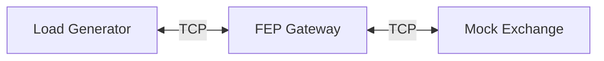

# HyperNet / HyperApp

C++20 기반의  이벤트 루프 엔진(`hypernet`)과 애플리케이션 런타임(`hyperapp`) 프로젝트입니다.
`Client` ↔ `Gateway` ↔ `Exchange` 로 구성된 파이프라인에서 세션 라우팅(Session Routing) 및 스레드 간 핸드오프(Cross-thread Handoff) 비용을 측정하기 위한 벤치마크 환경을 제공합니다.

## Architecture

전체 시스템은 다음 3가지 컴포넌트로 구성되어 있으며, TCP/IP 기반으로 통신합니다.



* **Mock Exchange**: 단순 주문 흐름을  모사 (Ping 수신 → Pong 반환)
* **FEP Gateway**: Client와 Exchange 사이의 중계 및 라우팅, 스레드 핸드오프(Handoff) 처리
* **LoadGen**: 지정한 세션 수로 접속하여 Ping/Pong 왕복 레이턴시(RTT) 측정

---

## Build

CMake를 사용하여 빌드합니다.

**Prerequisites**

* C++20 compliant compiler (GCC, Clang)
* CMake 3.20+

**Build Steps**

```bash
mkdir -p build
cmake -S . -B build -DCMAKE_BUILD_TYPE=Release
cmake --build build -j

```

**Artifacts**
빌드 완료 시 `build/bin/` 경로에 다음 바이너리가 생성됩니다.

* `mock_exchange`
* `fep_gateway`
* `loadgen`

---

## Benchmark Scenarios

각 시나리오는 `config/` 디렉토리 내의 TOML 설정 파일에 정의되어 있습니다.

| Scenario | Name | Description |
| --- | --- | --- |
| **s1** | Baseline | `worker_threads=1`. 단일 워커 스레드 처리 기준선 (No overhead) |
| **s2** | Scale/Local | `worker_threads=2`. 스레드 간 경합을 최소화한 로컬 라우팅 테스트 |
| **s3** | Handoff | `worker_threads=2`. Session-ID 기반 강제 Cross-worker handoff 비용 측정 |

---

## Benchmark Execution

스크립트를 통해 시나리오별 벤치마크를 수행할 수 있습니다.

### 1. 단일 시나리오 실행

```bash
# Baseline 측정
./scripts/run_bench.sh s1

# Multi-thread 확장성 테스트
./scripts/run_bench.sh s2

# Handoff 오버헤드 측정
./scripts/run_bench.sh s3

```

### 2. 반복 측정 (Sweep)

특정 횟수만큼 반복 실행하여 데이터의 일관성을 확보합니다.

```bash
# 각 시나리오 5회 반복 실행
./scripts/bench_sweep.sh 5

```

### 3. 결과 요약

최근 실행된 벤치마크 결과를 집계하여 터미널에 출력합니다.

```bash
# 최근 5건의 결과 요약
./scripts/summarize_bench.py --last 5

```

---

## Measurement Model (Important)

본 벤치마크(`loadgen`)의 부하 모델에 대한 중요 사항입니다.

> **Single In-flight Request Model**
> 현재 `loadgen`은 **In-flight Ping을 세션당 1개가 아닌, 전체 프로세스 기준 1개만 유지**합니다.
> 즉, 세션이 N개라 하더라도 "동시에 N개 요청"을 보내는 것이 아니라, **"한 번에 1개의 왕복(RTT)"을 세션만 순차적으로 바꿔가며 수행**합니다.

* **목적**: 순수 레이턴시(Latency p99/p99.9)의 회귀(Regression)를 정밀하게 추적하기 위함
* **한계**: 대규모 동시성(Concurrency)이나 최대 처리량(Max Throughput) 검증 모델로는 적합하지 않음

---

## Results Structure

모든 벤치마크 결과는 `results/` 디렉토리에 타임스탬프 별로 저장됩니다.

**Path:** `results/<scenario>/<timestamp>/`

* `report.txt`: 벤치마크 최종 요약 리포트
* `*.log`: 각 프로세스(`loadgen`, `fep`, `mock`)의 실행 로그
* `*.toml`: 실행 시점의 설정 파일 스냅샷 (`exchange`, `fep`, `client`)
* `system_info/`: 환경 정보 스냅샷 (`uname.txt`, `lscpu.txt`, `pinning.txt` 등)

---

## Project Layout

```text
.
├── apps/               # 실행 바이너리 소스 (main entry points)
│   ├── fep_gateway/
│   ├── loadgen/
│   └── mock_exchange/
├── config/             # 시나리오별 설정 파일 (s1, s2, s3)
├── domains/            # 도메인 비즈니스 로직
│   └── trading/        # Handshake, Benchmark 프로토콜 구현
├── engine/             # Core Network Engine (Epoll, Session, Router)
├── runtime/            # Application Runtime (StateMachine, Service Layer)
├── scripts/            # 벤치마크 자동화 및 유틸리티 스크립트
└── results/            # 벤치마크 실행 결과 저장소 (Ignore 처리됨)
